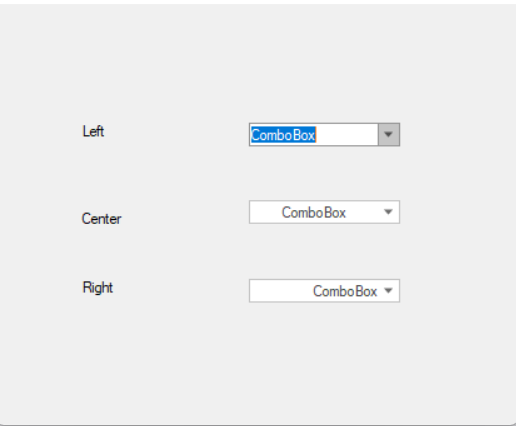

# How to Specify Text Alignment in WinForms ComboBoxAdv
## Overview
This example demonstrates how to align text within the Syncfusion WinForms ComboBoxAdv control. ComboBoxAdv is an enhanced version of the standard ComboBox, offering additional styling and layout capabilities. One of its useful features is the ability to control the alignment of the text displayed within the combo box.

You can customize text alignment using the **TextAlign** property, which supports:
- HorizontalAlignment.Left
- HorizontalAlignment.Center
- HorizontalAlignment.Right

## Example: Center Align Text
```C#

// Center-align text in ComboBoxAdv
comboBoxAdv.TextAlign = HorizontalAlignment.Center;

```
This simple property setting ensures that the text inside the ComboBoxAdv is visually centered, improving the overall appearance of the form.

## Reference
For more details, refer to the official Syncfusion Knowledge Base article: https://www.syncfusion.com/kb/3342/how-to-specify-text-alignment-in-winforms-comboboxadv

## Use Case
Ideal for developers looking to:
- Enhance the layout and readability of their WinForms applications
- Maintain consistent UI alignment across controls.

## Screenshot


